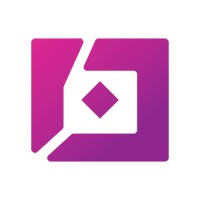

<!-- markdownlint-disable-next-line MD033 -->
#  Moss Samples

This repo bundles thin, working examples that show how to talk to Moss from Python and JavaScript. Each sample keeps the scaffolding light so you can copy the essentials straight into your own projects.

## Building with Moss

- Moss is an AI assistant platform; you send conversation state plus optional knowledge, Moss returns grounded answers.
- Samples show how to authenticate, batch context, and stream replies without extra boilerplate.
- Adapt the scripts by swapping the FAQ JSON files with your data, or plugging Moss calls into an existing app.
  
## Python SDK Quick Tour

- [`python/comprehensive_sample.py`](python/comprehensive_sample.py): end-to-end flow with session creation, context building, and streaming responses.
- [`python/load_and_query_sample.py`](python/load_and_query_sample.py): how to ingest domain knowledge before querying Moss.
- Install deps with `pip install -r python/requirements.txt`, then run any script via `python path/to/sample.py`.

## JavaScript SDK Quick Tour

- [`javascript/comprehensive_sample.ts`](javascript/comprehensive_sample.ts): TypeScript version of the full workflow, ready for Node.
- [`javascript/load_and_query_sample.ts`](javascript/load_and_query_sample.ts): demonstrates indexing FAQs and issuing targeted prompts.
- Install deps with `npm install` inside `javascript/`, then execute via `npm run start -- path/to/sample.ts`.

## Learn More

- API reference and latest tooling: [docs](https://moss-docs-seven.vercel.app/)
  
If you spot gaps or want another language example, open an issue or PR—we track feedback closely.
