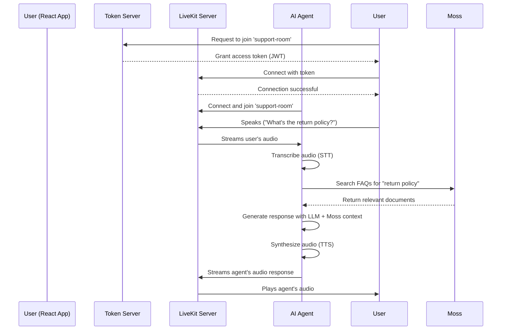

# LiveKit & Moss AI Voice Agent

This project demonstrates a real-time, AI-powered voice agent that uses **LiveKit** for audio streaming and **Moss** for semantic search-based knowledge retrieval. It includes the Python agent, a secure token server, and a minimal React frontend.

The agent is designed as a customer support assistant. It listens to user queries, searches a knowledge base of FAQs stored in Moss, and uses the search results to generate grounded, accurate responses with an LLM.

## How It Works

The architecture involves four main components running simultaneously:

1.  **LiveKit Server**: The core WebRTC server that manages the real-time audio/video communication session between the user and the agent.
2.  **AI Voice Agent (`agent.py`)**: A Python application built with the `livekit-agents` framework. It joins the LiveKit room, listens to the user's audio, performs STT, queries Moss, sends the results to an LLM, and speaks the response back using TTS.
3.  **Token Server (`token_server.py`)**: A lightweight Python Flask server. Its only job is to securely generate temporary access tokens that the frontend needs to connect to the LiveKit room. This prevents exposing your LiveKit API secrets on the client side.
4.  **React Frontend (`react-app/`)**: A simple, clean web interface that allows a user to connect to the agent. It handles requesting the token, connecting to the LiveKit room, and managing microphone permissions.

### High-Level Flow



## Project Structure

```text
livekit-agent/
├── agent.py               # The main AI voice agent logic
├── token_server.py        # Secure Flask server for LiveKit tokens
├── create_index.py        # Helper script to build the Moss FAQ index
├── faqs.json              # The raw FAQ data for the knowledge base
├── .env.example           # Template for environment variables
├── pyproject.toml         # Python dependencies
├── README.md              # This file
└── react-app/
    └── src/
        └── components/
            └── VoiceAgent.jsx # The core React component
```

## Getting Started

### Prerequisites

*   Python 3.9+
*   Node.js 18+ and `npm`
*   [uv](https://github.com/astral-sh/uv) (`pip install uv`) for Python dependencies
*   [LiveKit Server](https://docs.livekit.io/oss/deployment/local/) installed locally
*   API keys for:
    *   Moss (semantic search)
    *   An LLM provider (e.g., OpenAI, Azure)
    *   A STT provider (e.g., Deepgram)
    *   A TTS provider (e.g., Cartesia)

### 1. Install LiveKit Server

Before running the project, you need to install the LiveKit server.

**macOS (with Homebrew):**
```bash
brew install livekit
```

**Linux or WSL:**
```bash
curl -sSL https://get.livekit.io | bash
```

**Windows:**
Download the latest release binary from the [LiveKit GitHub Releases page](https://github.com/livekit/livekit/releases).

### 2. Configure Environment Variables

Copy the `.env.example` file to a new file named `.env` and fill in your API credentials.

```bash
cp .env.example .env
```

For local development, the LiveKit variables should be:

```env
# .env
LIVEKIT_URL="ws://localhost:7880"
LIVEKIT_API_KEY="devkey"
LIVEKIT_API_SECRET="secret"

# Add your Moss, LLM, STT, and TTS keys...
```

### 3. Install Dependencies

Install both the Python and Node.js dependencies.

```bash
# Install Python dependencies
uv sync

# Install frontend dependencies
cd react-app
npm install
cd ..
```

### 4. Build the Moss Knowledge Base

The agent needs a knowledge base to search. Run the `create_index.py` script to upload the contents of `faqs.json` to your Moss project.

```bash
uv run python create_index.py
```

## Running the Full Application

To run the complete system, you need to start all four services in separate terminal windows.

---

### Terminal 1: LiveKit Server

Start the local LiveKit server in development mode.

```bash
livekit-server --dev
```
> **Note:** You should see `INFO server listening {"addr": "127.0.0.1:7880"}`. Keep this running.

---

### Terminal 2: AI Voice Agent

Start the Python agent, which will wait to join a room.

```bash
uv run python agent.py dev
```
> **Note:** You should see `Agent started, waiting for room connections...`. Keep this running.

---

### Terminal 3: Token Server

Start the Flask server to handle token requests from the frontend.

```bash
python token_server.py
```
> **Note:** You should see `🚀 Starting token server on http://localhost:8080`. Keep this running.

---

### Terminal 4: React Frontend

Start the React development server.

```bash
cd react-app
npm run dev
```
> **Note:** This will open the web application at `http://localhost:3000`.

---

### Using the App

1.  Open `http://localhost:3000` in your browser.
2.  Click **"Start Call"**. Your browser will ask for microphone permission.
3.  Once connected, the status will update. Begin speaking.
4.  The agent will listen, process your query using Moss, and respond with audio.
5.  Click **"End Call"** when finished.

## Troubleshooting

*   **"Failed to get token" Error**: Ensure the Token Server (Terminal 3) is running on port 8080 and there are no errors in its console.
*   **"No permissions to access the room" Error**: This usually means the LiveKit Server (Terminal 1) is not running or the `LIVEKIT_` variables in your `.env` file are incorrect.
*   **No Audio from Agent**: Check the AI Voice Agent console (Terminal 2) for errors. Ensure it successfully connected and subscribed to your audio. Check the browser console (F12) for any audio playback errors.
*   **Agent Can't Hear You**: Make sure you granted microphone permission in the browser. The "Microphone Level" indicator in the UI should move when you speak.

## Customization

*   **Agent Logic**: Modify `agent.py` to change the agent's instructions (system prompt), the number of search results retrieved from Moss, or to switch LLM/STT/TTS providers.
*   **Knowledge Base**: Update `faqs.json` with your own data and re-run `uv run python create_index.py` to update the agent's knowledge.
*   **Frontend UI**: The React UI is located in `react-app/`. The main component is `src/components/VoiceAgent.jsx`. You can modify the styles in the corresponding `.css` file.
