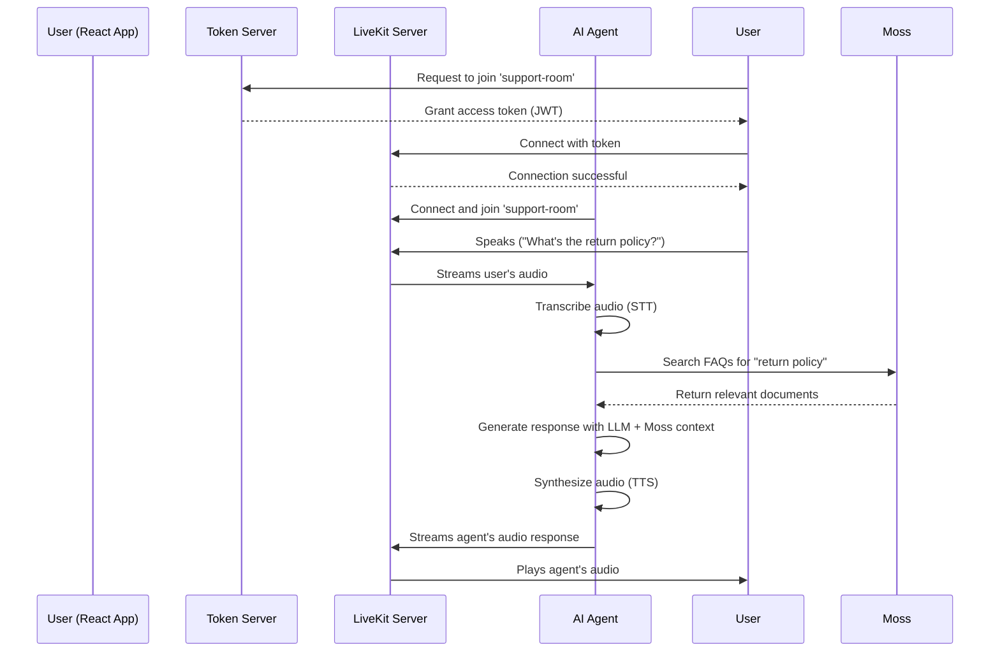

# LiveKit & Moss AI Voice Agent

This project demonstrates a real-time, AI-powered voice agent that uses **LiveKit** for audio streaming and **Moss** for semantic search-based knowledge retrieval. It includes the Python agent, a secure token server, and a minimal React frontend.

The agent is designed as a customer support assistant. It listens to user queries, searches a knowledge base of FAQs stored in Moss, and uses the search results to generate grounded, accurate responses with an LLM.

## How It Works

The architecture involves four main components running simultaneously:

1.  **LiveKit Server**: The core WebRTC server that manages the real-time audio/video communication session between the user and the agent.
2.  **AI Voice Agent (`agent.py`)**: A Python application built with the `livekit-agents` framework. It joins the LiveKit room, listens to the user's audio, performs STT, queries Moss, sends the results to an LLM, and speaks the response back using TTS.
3.  **Token Server (`token_server.py`)**: A lightweight Python Flask server. Its only job is to securely generate temporary access tokens that the frontend needs to connect to the LiveKit room. This prevents exposing your LiveKit API secrets on the client side.
4.  **React Frontend (`react-app/`)**: A simple, clean web interface that allows a user to connect to the agent. It handles requesting the token, connecting to the LiveKit room, and managing microphone permissions.

### High-Level Flow



### React Frontend and LiveKit Integration

The `react-app/` directory contains a simple React application that demonstrates how to build a client for the voice agent. The core logic is in `src/components/VoiceAgent.jsx`. Here’s how it works with the `livekit-client` SDK:

1.  **Token Authentication**: Before connecting, the app fetches a temporary access token from the `token_server.py`. This is a crucial security step to avoid exposing your LiveKit API secrets in the frontend code. The server validates the request and issues a short-lived JSON Web Token (JWT).
    ```javascript
    const { token, url } = await getToken(roomName, userName);
    ```

2.  **Connecting to the Room**:
    *   It creates an instance of the `Room` class from the `livekit-client` SDK.
    *   It calls the `room.connect(url, token)` method, passing the WebSocket URL of your LiveKit server and the JWT obtained in the previous step.
    ```javascript
    await room.connect(connectionUrl, token);
    ```

3.  **Publishing the Microphone**:
    *   To send the user's audio to the agent, the app creates a local audio track using `createLocalAudioTrack()`.
    *   This track is then published to the room via `room.localParticipant.publishTrack(track)`, making the user's voice available to other participants (i.e., the agent).
    ```javascript
    const localAudioTrack = await createLocalAudioTrack();
    await room.localParticipant.publishTrack(localAudioTrack);
    ```

4.  **Subscribing to Agent's Audio**:
    *   The app listens for the `RoomEvent.TrackSubscribed` event. When the AI agent joins and publishes its audio track, this event fires.
    *   The handler receives the remote `track` object. To play the agent's audio, it attaches the track to a standard HTML `<audio>` element using `track.attach(audioElement)`.
    ```javascript
    room.on(RoomEvent.TrackSubscribed, (track, publication) => { ... });
    track.attach(audioElRef.current);
    ```

5.  **Handling Speaking Events**:
    *   The app listens for audio level changes on the agent's track (`Track.Event.AudioLevelChanged`) to determine if the agent is currently speaking.
    *   This is used to update the UI with an "Agent Speaking" or "Agent Listening" indicator, providing clear visual feedback to the user.
    ```javascript
    publication.on(Track.Event.AudioLevelChanged, (level) => { ... });
    ```

6.  **Managing State**: The application uses React state (`useState`) to track the connection status (`'connecting'`, `'connected'`, `'disconnected'`), which dynamically updates the UI to show the current state of the call.
    ```javascript
    const [status, setStatus] = useState('disconnected');
    ```

This setup provides a robust foundation for building real-time voice experiences on the web.

## Project Structure

```text
livekit-agent/
├── agent.py               # The main AI voice agent logic
├── token_server.py        # Secure Flask server for LiveKit tokens
├── create_index.py        # Helper script to build the Moss FAQ index
├── settings.py            # Configuration settings for models and services
├── faqs.json              # The raw FAQ data for the knowledge base
├── .env.example           # Template for environment variables
├── pyproject.toml         # Python dependencies
├── README.md              # This file
└── react-app/
    └── src/
        └── components/
            └── VoiceAgent.jsx # The core React component
```

## Configuration

The project uses a centralized `settings.py` file to manage all model and service configurations. This makes it easy to customize the agent without modifying the core code.

### Available Settings

The settings file includes configurations for:

*   **STT (Speech-to-Text)**:
    *   `provider`: Default is "deepgram"
    *   `model`: Default is "nova-2"
    *   `language`: Default is "en"

*   **LLM (Large Language Model)**:
    *   `provider`: Default is "openai"
    *   `model`: Default is "gpt-4o-mini"
    *   `temperature`: Default is 0.7
    *   `max_tokens`: Optional, not set by default

*   **TTS (Text-to-Speech)**:
    *   `provider`: Default is "cartesia"
    *   `model`: Default is "sonic-2"
    *   `voice`: Default voice ID for Cartesia
    *   `speed`: Default is 1.0

*   **VAD (Voice Activity Detection)**:
    *   `provider`: Default is "silero"

*   **Moss (Knowledge Base)**:
    *   `index_name`: Default is "support-faqs" (configure in settings.py)
    *   `model_id`: Default is "moss-minilm"
    *   `top_k_results`: Number of results to retrieve (default: 6)
    *   Note: Moss credentials (`MOSS_PROJECT_ID`, `MOSS_PROJECT_KEY`) are read from environment variables in `.env`

### Customizing Settings

You can customize the settings in two ways:

1.  **Modify `settings.py` directly**: Change the default values in the dataclass definitions.

2.  **Use environment variables for secrets**: API keys and credentials (like `MOSS_PROJECT_ID`, `MOSS_PROJECT_KEY`) should be stored in your `.env` file and are not part of the settings configuration.

Example modifications in `settings.py`:

```python
@dataclass
class LLMConfig:
    """Large Language Model configuration."""
    provider: str = "openai"
    model: str = "gpt-4"  # Changed from gpt-4o-mini
    temperature: float = 0.5  # Changed from 0.7
    max_tokens: Optional[int] = 2000  # Added token limit
```

## Getting Started

### Prerequisites

*   Python 3.9+
*   Node.js 18+ and `npm`
*   [uv](https://github.com/astral-sh/uv) (`pip install uv`) for Python dependencies
*   [LiveKit Server](https://docs.livekit.io/oss/deployment/local/) installed locally
*   API keys for:
    *   Moss (semantic search)
    *   An LLM provider (e.g., OpenAI)
    *   A STT provider (e.g., Deepgram)
    *   A TTS provider (e.g., Cartesia)
    *   LiveKit Server(can be generated locally)

### 1. Install LiveKit Server

Before running the project, you need to install the LiveKit server.

**macOS (with Homebrew):**
```bash
brew install livekit
```

**Linux or WSL:**
```bash
curl -sSL https://get.livekit.io | bash
```

**Windows:**
Download the latest release binary from the [LiveKit GitHub Releases page](https://github.com/livekit/livekit/releases).

### 2. Configure Environment Variables

Copy the `.env.example` file to a new file named `.env` and fill in your API credentials.

```bash
cp .env.example .env
```

For local development, the LiveKit variables should be:

```env
# .env
LIVEKIT_URL="ws://localhost:7880"
LIVEKIT_API_KEY="devkey"
LIVEKIT_API_SECRET="secret"

# Add your Moss, LLM, STT, and TTS keys...
```

### 3. Install Dependencies

Install both the Python and Node.js dependencies.

```bash
# Install Python dependencies
uv sync

# Install frontend dependencies
cd react-app
npm install
cd ..
```

### 4. Build the Moss Knowledge Base

The agent needs a knowledge base to search. Run the `create_index.py` script to upload the contents of `faqs.json` to your Moss project.

```bash
uv run python create_index.py
```

## Running the Full Application

To run the complete system, you need to start all four services in separate terminal windows.

---

### Terminal 1: LiveKit Server

Start the local LiveKit server in development mode.

```bash
livekit-server --dev
```
> **Note:** You should see `INFO server listening {"addr": "127.0.0.1:7880"}`. Keep this running.

---

### Terminal 2: AI Voice Agent

Start the Python agent, which will wait to join a room.

```bash
uv run python agent.py dev
```
> **Note:** You should see `Agent started, waiting for room connections...`. Keep this running.

---

### Terminal 3: Token Server

Start the Flask server to handle token requests from the frontend.

```bash
python token_server.py
```
> **Note:** You should see `🚀 Starting token server on http://localhost:8080`. Keep this running.

---

### Terminal 4: React Frontend

Start the React development server.

```bash
cd react-app
npm run dev
```
> **Note:** This will open the web application at `http://localhost:3000`.

---

### Using the App

1.  Open `http://localhost:3000` in your browser.
2.  Click **"Start Call"**. Your browser will ask for microphone permission.
3.  Once connected, the status will update. Begin speaking.
4.  The agent will listen, process your query using Moss, and respond with audio.
5.  Click **"End Call"** when finished.

### Talk with the agent on the console

For quick testing and debugging, you can interact with the agent directly in your terminal without needing the full LiveKit setup. The console mode allows you to type messages and receive text-based responses.

```bash
uv run python agent.py console
```

Once started, you can type your questions directly into the console and the agent will reply with the response it would have spoken. This is useful for testing the agent's knowledge retrieval and LLM responses without dealing with audio.

## Troubleshooting

*   **"Failed to get token" Error**: Ensure the Token Server (Terminal 3) is running on port 8080 and there are no errors in its console.
*   **"No permissions to access the room" Error**: This usually means the LiveKit Server (Terminal 1) is not running or the `LIVEKIT_` variables in your `.env` file are incorrect.
*   **No Audio from Agent**: Check the AI Voice Agent console (Terminal 2) for errors. Ensure it successfully connected and subscribed to your audio. Check the browser console (F12) for any audio playback errors.
*   **Agent Can't Hear You**: Make sure you granted microphone permission in the browser. The "Microphone Level" indicator in the UI should move when you speak.

## Customization

*   **Model Configuration**: Use `settings.py` to easily customize all model settings (LLM, STT, TTS, etc.) without modifying the main agent code. See the [Configuration](#configuration) section for details.
*   **Agent Behavior**: Modify the `instructions` and `initial_greeting_instructions` fields in `settings.py` to change the agent's personality and behavior.
*   **Knowledge Base**: Update `faqs.json` with your own data and re-run `uv run python create_index.py` to update the agent's knowledge.
*   **Frontend UI**: The React UI is located in `react-app/`. The main component is `src/components/VoiceAgent.jsx`. You can modify the styles in the corresponding `.css` file.
